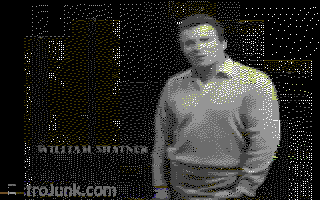

# pynuvie

A pure-Python library and command-line tool to **read, write, encode and
document** Commodore 64 [NUVIE](https://www.c64-wiki.de/wiki/Nuvie) REU video
files — no emulator and no original tools required.

A NUVIE is a 16 MiB [REU](https://www.c64-wiki.com/wiki/REU) image holding a
sequence of [NUFLI](https://www.c64-wiki.com/wiki/NUFLI) still images, an optional
SID soundtrack, and a playlist that scripts playback. NUVIEs are normally produced
on a real C64 (or in VICE) with Crest's `NUVIEmaker`; `pynuvie` reads, builds and
documents the same files in pure Python.

## Showcase

30 seconds of a VIC-20 ad, encoded by `pynuvie`'s FLI-aware encoder and rendered
as the C64 would show it — full colour and greyscale, 16 colours, 320×200:

| colour | greyscale |
| --- | --- |
|  |  |

## Install

```sh
pip install pynuvie          # core library + CLI
pip install pynuvie[image]   # also decode/encode images (needs Pillow + numpy)
```

`numba` (in the `dev` extra) is an optional accelerator for the encoder; it is not
required and does not change the output.

## Library

```python
from nuvie import Nuvie

movie = Nuvie.read("zardoz.reu")
print(movie)                         # <Nuvie valid=True frames=256 music=False>
print(movie.control)                 # music flags, borders, infoscreen, charset
for tok in movie.playlist:           # decoded playback script
    print(tok.describe())

slot = movie.frame(0)                # one frame as its 21840-byte slot
movie.set_frame(0, slot)
movie.write("out.reu")               # losslessly round-trips
```

Decode a standalone NUFLI `.nuf` image to a picture, and encode one back:

```python
from PIL import Image
from nuvie.nufli import NufliImage

NufliImage.from_prg(open("000.nuf", "rb").read()).to_image().save("000.png")

# FLI-aware encode: per-8x2 ink/paper + the sprite-underlay third colour,
# co-designed with a 2px-pair error-diffusion dither.
nuf = NufliImage.from_image(Image.open("photo.png"))   # backend="clean" (default)
```

Encode a video into a player-ready NUVIE:

```python
from nuvie.encode import encode_video
encode_video("clip.mp4", "clip.reu", fps=12.5)

from nuvie import build_movie                          # or from a list of images
build_movie([img0, img1, ...], "out.reu")
```

The encoder and the byte-exact packer are described in
[`research/ENCODING.md`](research/ENCODING.md).

## CLI

```sh
nuvie info movie.reu                       # signature, frame count, music, playlist
nuvie playlist movie.reu                   # full decoded playlist
nuvie extract movie.reu -o frames/         # dump each frame as a .slot
nuvie build frames/*.slot -o out.reu       # pack frame slots into a NUVIE
nuvie encode clip.mp4 -o clip.reu          # video -> NUVIE (parallel; --workers N)
nuvie music clip.reu --csv tune.csv        # attach a SID soundtrack from a CSV
nuvie testpattern -o test.reu --style colour   # gradient showcase, no video needed
```

### SID music from a CSV

NUVIE stores its soundtrack as a stream of SID **register dumps** — 25 register
values (`$D400..$D418`) for every 1/50 s tick. That maps onto a CSV with one row
per tick and 25 integer columns (`0..255`, decimal or `0x` hex; a non-numeric
header row is ignored):

```sh
nuvie music clip.reu --csv tune.csv             # add/loop music in place
nuvie music clip.reu --csv tune.csv -o out.reu --restart   # write a copy, restart per loop
nuvie encode clip.mp4 -o clip.reu --music tune.csv         # encode + score in one step
```

```python
from nuvie import Nuvie, read_sid_csv
movie = Nuvie.read("clip.reu")
movie.set_music(read_sid_csv("tune.csv"))       # or flag=MUSIC_RESTART
movie.write("clip.reu")
```

Music grows down from the top of the REU, so a scored movie holds fewer than the
768 frames a silent one can.

## See it run

Generate a showcase test pattern (no video file needed) and play it on the C64:

```sh
nuvie testpattern -o test.reu --style colour -n 64    # or --style greyscale
```

Play `test.reu` in [VICE](https://vice-emu.sourceforge.io/)'s `x64sc` with Crest's
`nuvieplayer1.0.prg` (from the
[NUVIEmaker 0.1e release](https://csdb.dk/release/?id=100031)):

```sh
# VICE wipes the REU image on exit, so play a copy:
cp test.reu test-play.reu
x64sc -warp -reu -reusize 16384 -reuimage test-play.reu -reuimagerw \
      -autostart nuvieplayer1.0.prg
```

The byte format is documented in [`docs/FORMAT.md`](docs/FORMAT.md). The leftmost
~24px is NUFLI's "flibug" edge, an FLI sprite trick that `pynuvie` generates
deterministically so it follows the picture (see
[`docs/FORMAT.md`](docs/FORMAT.md#the-left-24px-flibug-edge-generated-flibugtrue-default)).

## License

Apache-2.0. NUVIE, NUVIEmaker, NUFLI and the reference player are the work of
Crossbow & DeeKay of Crest.
